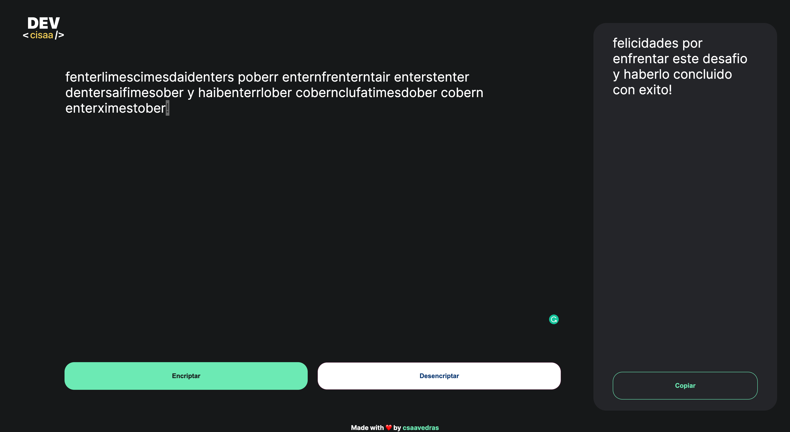

<!-- Please update value in the {}  -->

<h1 align="center">Encoder Text Project  <h1>

   Solution for a challenge from  <a href="https://www.aluracursos.com/" target="_blank">Alura Latam</a>.

  <h3>
    <a href="https://www.figma.com/file/ESo1dbpTUOL1TnYeGPHnlP/Alura-Challenge---Desaf%C3%ADo-1---L%C3%B3gica-(Copy)?node-id=0%3A1">
      Demo Figma
    </a>
     | 
    <a href="https://csaavedras.github.io/Challenge_Oracle_ONE__Sprin01/">
      Solution
    </a>
  </h3>

<!-- TABLE OF CONTENTS -->

## Table of Contents

- [Overview](#overview)
  - [Built With](#built-with)
- [Features](#features)
- [Contact](#contact)

<!-- OVERVIEW -->

## Overview

Introduce your projects by taking a screenshot or a gif. Try to tell visitors a story about your project by answering:

- Where can I see your demo?
  We can see the complete result of the requested UI, based on Figma's designs, with a complete responsive experience.
- What was your experience?
  It was an entertaining experience, I followed step by step the support we had in the Trello app.
- What have you learned/improved?
  I started this challenge with the skill that had the least difficulty for me, that is, transforming a design to HTML/CSS, and then solving the logic of the application. Finally, I divided the logic of my program into smaller problems and separated them into functions to achieve each goal.Apply and use the following concepts: objects, addEventListener, querySelector, preventDefault(), regex expressions, replace() and other elements for DOM manipulation.

### Built With

<!-- This section should list any major frameworks that you built your project using. Here are a few examples.-->

- [Tools]: VSCode, Git, GitHub, Figma, Live Server, Git Flow.
- [Tech Stack]: JavaScript - HTML/CSS

## Features

<!-- List the features of your application or follow the template. Don't share the figma file here :) -->

This project allows us to transform all the vowels of a phrase or word into a secret code to encrypt the text entered by the user.
There is also the possibility of copying encrypted text and decrypting it.

## Contact

- GitHub [csaavedras](https://github.com/csaavedras/)
- Twitter [cisaavedras](https://twitter.com/cisaavedras)
